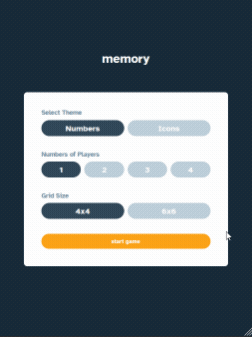
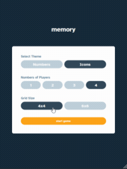

# Frontend Mentor - Memory game solution

This is a solution to the [Memory game challenge on Frontend Mentor](https://www.frontendmentor.io/challenges/memory-game-vse4WFPvM). Frontend Mentor challenges help you improve your coding skills by building realistic projects.

## Table of contents

- [Overview](#overview)
  - [The challenge](#the-challenge)
  - [Screenshot](#screenshot)
  - [Links](#links)
- [My process](#my-process)
  - [Built with](#built-with)
  - [What I learned](#what-i-learned)
  - [Useful resources](#useful-resources)
- [Author](#author)
- [Acknowledgments](#acknowledgments)

## Overview

### The challenge

Users should be able to:

- View the optimal layout for the game depending on their device's screen size
- See hover states for all interactive elements on the page
- Play the Memory game either solo or multiplayer (up to 4 players)
- Set the theme to use numbers or icons within the tiles
- Choose to play on either a 6x6 or 4x4 grid

### Screenshot

 

### Links

- Live Site URL: [live site URL](https://jconan-memory-game-challenge.netlify.app/)

## My process

1. create test first approches (TDD)
2. implements logic without styling
3. add styling mobile first (no test to validate styling)
4. add media queries for responsiveness

### Built with

- [Testing Library](https://testing-library.com/) - Testing library
- [React](https://reactjs.org/) - JS library
- [Saas](https://sass-lang.com/) - CSS with superpowers

### What I learned

I am sticking to the TDD lifecycle and what I learn most is about how use Timer Mocks with jest.
Indeed, there is a need to implement a Timer function for displaying the total time past in the game.
I also needed some sort of "time-based flip-flop switch" in order to delay the resolution of the tiles states.

- jest.useFakeTimers
- jest.advanceTimersByTime

Hooks useRef where really usefull because I need to work with the same timer instance when displaying the Menu or restarting the game.

### Useful resources

[Timer Mocks](https://jestjs.io/docs/timer-mocks)

## Author

- Frontend Mentor - [@JConan](https://www.frontendmentor.io/profile/JConan)
- Code Wars - [@JConan](https://www.codewars.com/users/JConan)
